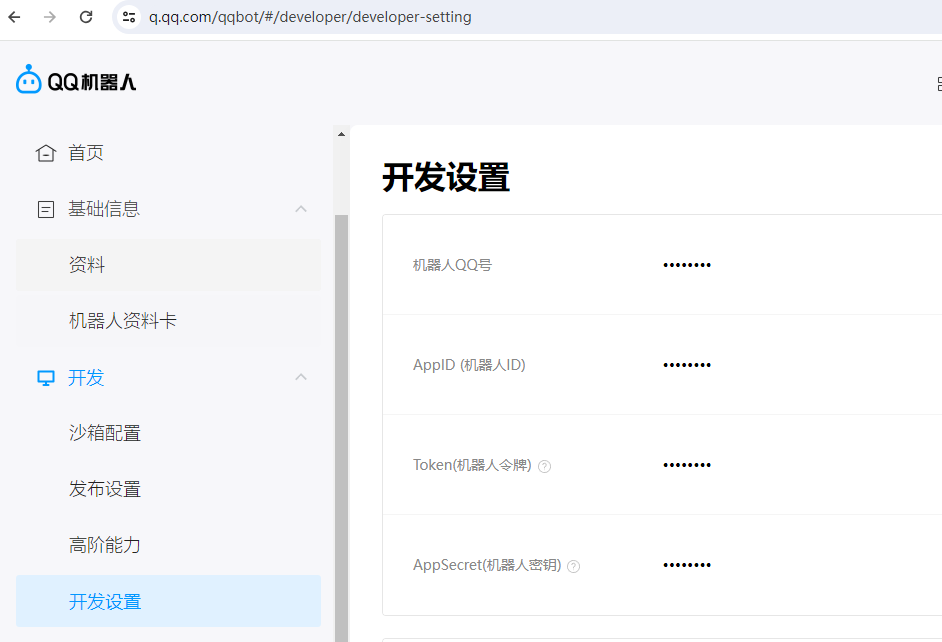

# RinBOT

RinBOT是使用Node.js开发的BOT服务端，支持接入Mirai-HTTP、官方BOT。

## 配置BOT

1. 编辑`cfg/cfg.template.js`配置文件
2. 重命名为`cfg.js`
3. 查看下面教程配置BOT

## 连接官方BOT



打开`cfg/cfg.template.js`  修改

```
botlist : [
        {
            appid : "申请的APPID",
            ak : "申请的APPSecret",
            qqchannel_at : false,  // 公域填true,私域填false
            qqgroup_pd : false, // 拥有群权限填true 没有填false
            run : true,
        },
        {
            appid : "申请的二号机APPID",
            ak : "申请的二号机APPSecret",
            qqchannel_at : false,  // 公域填true,私域填false
            qqgroup_pd : false, // 拥有群权限填true 没有填false
            run : true,
        },
]
```

## 连接MiraiBOT

下载最新Mirai一键包 `https://github.com/iTXTech/mcl-installer`

下载mirai-http插件`https://github.com/project-mirai/mirai-api-http`

Mirai签名插件 `https://github.com/cssxsh/fix-protocol-version`

自搭签名win `https://gitee.com/wuliya336/qsign?_from=gitee_search`

自搭签名linux `https://gitee.com/cikeyqi/unidbg-fetch-qsign-shell?_from=gitee_search`

打开`config/net.mamoe.mirai-api-http/setting.yml`

把http的jar放到mirai的plugin目录

然后自搭签名服务器

运行Mirai程序

签名自己解决不谈。

```
adapters: 
  - ws
debug: false
enableVerify: false
singleMode: false
verifyKey: 连接密码
cacheSize: 4096
persistenceFactory: 'built-in'
adapterSettings:
  ws:
    host: localhost ## 本地IP
    port: 8080 ## 启动的端口
    reservedSyncId: -1
```

打开`cfg/cfg.template.js`  修改

```
mirai_wsport : "mirai端口",
mirai_host : "miraiIP",
verifyKey : "连接密码",
```

## 开始启动

1. 通过指令`node main.js`运行BOT
2. 发生错误？安装`node.js`

## 其他教程

#### [通过宝塔面板安装node](./md/bt.md)

#### [开发自定义指令插件](./md/plugin.md)
